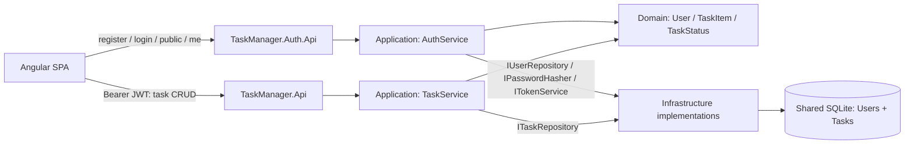

# Architecture

This is a personal task manager with two executable APIs, one Angular SPA and one SQLite file. The split satisfies the assessment's explicit second-API requirement; it does not introduce separate business layers, databases or host-to-host calls.



Arrows above describe runtime calls through application interfaces. Compile-time dependencies flow inward: Application references Domain; Infrastructure references Application and Domain; both API projects reference the inner projects to compose concrete dependencies. Domain has no project/package dependencies. Neither API references the other. Angular communicates only through HTTP.

`src/backend/SharedApi` is linked source compiled into both hosts, providing common configuration, middleware, safe errors and claim extraction. It is presentation code, not an additional architectural layer. `Infrastructure/Authentication/JwtValidation` centralizes JWT validation. See DEC-014–018 for module organization and final contracts.

## Authentication and requests

1. Angular sends `{ username, password }` to Auth.Api registration or login. `AuthController` delegates to `AuthService`. Username/password policy and uniqueness handling belong to Application; Infrastructure supplies the SQLite user repository and supported framework hasher.
2. Registration stores only the salted password hash. Both successful registration and login return safe identity, access token and UTC expiry. `JwtTokenService` issues HS256 JWTs.
3. Angular stores only the JWT in sessionStorage. On same-tab refresh, `AuthService.initialize` checks malformed/expired storage for UX, then calls protected `/api/auth/me` to restore identity before guards permit `/tasks`.
4. The scoped interceptor sends Bearer only to the configured auth `/api/auth/me` and task `/api/tasks` boundaries. Guard decisions improve navigation UX; server middleware enforces authentication independently.
5. Both hosts validate the same issuer, logical backend audience and externally configured random signing key, plus signature, HS256 and lifetime, with zero clock skew and no inbound claim remapping. `CurrentIdentity` requires exactly one positive integer `sub`. A Task.Api request needs no call to Auth.Api to validate the token.
6. Expiry and logout clear the Angular session. A protected 401 invalidates only the matching token, so a delayed response from an older session cannot clear a newer login. There are no refresh tokens or server-side token revocation. `/me` returns safe claims identity; it is not a database-backed revocation/account lookup.

## Task CRUD and ownership

`TasksController` is authorized at class level. It extracts the validated claim owner and passes it with editable `TaskRequest` fields to `TaskService`. There is no request owner field. The service validates identifiers and constructs `TaskItem`, whose invariants normalize title/description and enforce length/status rules. Infrastructure executes parameterized SQL and explicitly maps rows.

Reads, updates and deletes include task ID AND user ID predicates. The service also checks returned ownership defensively. Update/delete affected-row checks handle a resource disappearing between lookup and mutation. Missing and inaccessible tasks yield the same `TaskNotFoundException` and safe 404, avoiding disclosure of another user's record. List queries select only the owner; the service also filters defensively. No frontend-supplied `userId` can change ownership.

POST returns 201 with a GET Location, PUT 200 with saved representation, DELETE 204. Input/model-binding errors yield 400; authentication failures 401; duplicate usernames 409; unexpected exceptions safe 500 ProblemDetails. Domain/Application do not depend on HTTP types.

Status is the stable numeric enum 0 Pending / 1 InProgress / 2 Completed. Due date is .NET DateOnly, JSON `dueDate` and SQLite invariant `yyyy-MM-dd`; Angular passes a validated calendar string without JavaScript Date or timezone conversion. The assessment's `due_date` maps to this camelCase field. Past dates are permitted.

## Persistence and startup

Both hosts require an external absolute SQLite Data Source independent of content/working directories, create its parent directory, and run transactional idempotent schema initialization. `SqliteConnectionFactory` opens independent connections, enables foreign keys and registers the shared `USERNAME_IDENTITY` collation; repositories dispose connections, commands and readers. Users have a primary key and unique case-insensitive identity index; Tasks have a primary key and user foreign key. SQL values use parameters; no ORM or mediator is used.

Only Auth.Api hashes `demo / Demo123!` and calls `SqliteDemoSeeder`. Exactly three tasks are inserted only when the demo account is newly inserted. Subsequent startup preserves credentials and task edits/deletions; no data reset occurs. Task.Api can start first without seed data. This initializer is intentionally a small schema setup, not a general migration framework.

## Verification boundaries

Application unit tests use repository/crypto ports. Infrastructure tests run real isolated SQLite. Both WebApplicationFactory suites exercise complete HTTP pipelines, including an actual Auth.Api login-issued token accepted by Task.Api. Angular regular tests cover forms, services, routing and session/error behavior; two opt-in live cases use real HttpClient and both running hosts. Real HTTP/security and browser evidence extend those checks, with exact current results and environment limits in [M8 completion](M8_COMPLETION.md).

## Source organization

The solution contains five production projects and four test projects. Backend code lives under `src/backend`: Domain entities/invariants, Application `Authentication`/`Tasks`/`Users`, Infrastructure `Authentication`/`Persistence/Repositories`, and the two feature-oriented controller hosts. `tests/SharedApiTests` links common HTTP test support into the host test projects. Angular lives under `src/frontend/task-manager-web`, organized into `core/auth`, `auth` and `tasks`.

## Host configuration

| Setting (environment variable) | Behavior |
| --- | --- |
| `ConnectionStrings:TaskManager` (`ConnectionStrings__TaskManager`) | Required valid SQLite connection string with absolute file Data Source; same file for both processes. Missing/empty/relative/in-memory host configuration fails startup. |
| `Jwt:Issuer` (`Jwt__Issuer`) | Required nonblank issuer, identical in both hosts. |
| `Jwt:Audience` (`Jwt__Audience`) | Required nonblank logical backend audience, identical in both hosts. |
| `Jwt:SigningKey` (`Jwt__SigningKey`) | Required Base64 random key of at least 32 bytes. Never commit it. |
| `Jwt:LifetimeMinutes` (`Jwt__LifetimeMinutes`) | Default 15; permitted 1–60. |
| `Cors:FrontendOrigin` (`Cors__FrontendOrigin`) | Default `http://localhost:4200`; one explicit HTTP(S) origin, no unrestricted origins. |

The HTTP hosts reject in-memory database configuration; the connection factory still supports isolated caller-supplied test configurations. Username identity trims boundaries, permits 3–64 UTF-16 characters excluding controls, preserves display casing and compares with `StringComparer.OrdinalIgnoreCase`. Existing case/trim-equivalent account collisions fail initialization transactionally. External username writers must register the same SQLite collation. Passwords permit 8–128 UTF-16 characters, reject whitespace-only input and preserve spaces. The framework IdentityV3 hasher uses salted PBKDF2-HMAC-SHA512 with 210,000 iterations. See [DEC-012/013](DECISIONS.md) for rationale and limits.

## HTTP contract

| Host | Endpoint | Success | Errors |
| --- | --- | --- | --- |
| Auth.Api | `POST /api/auth/register` | 201 with user ID, username, access token and UTC expiration | 400 input; 409 duplicate |
| Auth.Api | `POST /api/auth/login` | 200 with same authentication result | 400 input; generic 401 credentials |
| Auth.Api | `GET /api/auth/public` | Anonymous 200 with small public message | — |
| Auth.Api | `GET /api/auth/me` | Protected 200 with user ID/display username | 401 authentication |
| Task.Api | `GET /api/tasks` | Protected 200 with owned tasks; empty collection is `[]` | 401 authentication |
| Task.Api | `GET /api/tasks/{id}` | Protected 200 with owned task | 400 malformed ID; 401; 404 |
| Task.Api | `POST /api/tasks` | Protected 201 with task and GET-by-ID Location | 400; 401 |
| Task.Api | `PUT /api/tasks/{id}` | Protected 200 with updated task | 400; 401; 404 |
| Task.Api | `DELETE /api/tasks/{id}` | Protected 204 | 400; 401; 404 |

Missing and inaccessible tasks return the same 404. Errors use safe ProblemDetails, including unexpected 500 responses; login never distinguishes unknown username from wrong password. Responses never include passwords, password hashes or signing keys. Registration returns 201 without inventing a user resource Location.

Task requests contain `title`, optional `description`, required `dueDate`, and optional numeric `status` (0 Pending, 1 InProgress, 2 Completed; default Pending). `dueDate` is the JSON spelling of the assessment's `due_date` calendar field. Results also contain server-assigned `id` and `userId`. Titles are trimmed/required with maximum 120 characters; descriptions maximum 1000. Past dates are allowed. Example request:

```json
{"title":"Review assessment","description":"Check requirements","dueDate":"2026-10-03","status":0}
```

## Angular state and validation

`src/app/core/api-config.ts` contains separate public defaults: `authApiBaseUrl=http://localhost:5150` and `taskApiBaseUrl=http://localhost:5149`. Use host base URLs without trailing slashes. A changed frontend origin must match `Cors__FrontendOrigin` in both hosts; backend secrets never belong in frontend configuration.

Standalone authentication/task pages use Router, HttpClient, Reactive Forms and local signals. Only the JWT is stored under `task-manager.access-token` in sessionStorage. Same-tab restoration calls `/me`; client expiry parsing is UX only. Forms mirror server bounds for feedback, while Domain/Application and API binding remain authoritative. Ten-second request timeouts retain drafts/rows after failures; reload checks persisted state after an uncertain write. TasksPage applies saved POST/PUT results and successful DELETE only, confirms deletion inline, prevents duplicate submission/reload overlap, and offers Cancel/Reload after a concurrent-delete 404. See [DEC-017/018](DECISIONS.md).

## Live Angular probes

Regular tests use HTTP mocks and skip two opt-in probes. Start both APIs using the [README configuration](../README.md#quick-start--windows-powershell) with a **new disposable absolute SQLite filename**; probes create test accounts and mutate tasks. From `src/frontend/task-manager-web`:

```powershell
$env:M5_LIVE = '1'
$env:M6_LIVE = '1'
try { npm test -- --watch=false }
finally { Remove-Item Env:M5_LIVE, Env:M6_LIVE }
```

M5 uses actual AuthService/HttpClient/interceptor registration/login, protected `/me`, Task.Api collection access, storage restoration and logout. M6 navigates through the guard and uses TasksPage/TaskService for CRUD, all numeric statuses, calendar round trips and recoverable real 404 after concurrent deletion. Neither manually inserts JWT headers. These probes are test-only; they require no ignored helper or browser e2e runner. Production output from `npm run build` is `dist/task-manager-web`.

## Local runtime reference

The [README](../README.md) launches Auth.Api first for demo seeding and then Task.Api from one configured PowerShell shell. Each uses `dotnet run --no-build --project <host-project> --launch-profile http`. Interactive terminals may use the same commands only after receiving the exact same database/JWT settings.

To inspect the HTTP flow after both startup logs show listeners, run in the configured root shell without displaying tokens:

```powershell
Invoke-RestMethod -Uri 'http://localhost:5150/api/auth/public'
$taskManagerLogin = Invoke-RestMethod -Method Post `
    -Uri 'http://localhost:5150/api/auth/login' -ContentType 'application/json' `
    -Body (@{ username = 'demo'; password = 'Demo123!' } | ConvertTo-Json)
$taskManagerHeaders = @{ Authorization = "Bearer $($taskManagerLogin.accessToken)" }
Invoke-RestMethod -Uri 'http://localhost:5150/api/auth/me' -Headers $taskManagerHeaders
Invoke-RestMethod -Uri 'http://localhost:5149/api/tasks' -Headers $taskManagerHeaders
```

For HTTPS, the existing `https` profiles expose Auth.Api 7139 and Task.Api 7138 (plus their HTTP listeners). Use trusted local development certificates and matching Angular API URLs. HTTP-only profiles emit the documented missing HTTPS-redirection-port warning; the middleware policy remains enabled.

When finished, press Ctrl+C in the Angular terminal. In the shell retaining the README's process objects, stop only those API process trees:

```powershell
taskkill /PID $taskManagerAuthProcess.Id /T /F
taskkill /PID $taskManagerTaskProcess.Id /T /F
```

Startup troubleshooting uses `.local/auth-output.log`, `auth-error.log`, `task-output.log` and `task-error.log`. Check identical absolute database paths, issuer/audience/key and available localhost ports. A new signing key invalidates existing tokens, requiring login again. An existing demo account retains its credentials and edits/deletions; choose a new database filename for deterministic seeds. `.local/`, SQLite data and `TestResults/` are ignored runtime artifacts. Historical launcher/harness files are validation provenance, not clean-clone prerequisites.
